<!--
**jloh02/jloh02** is a ✨ _special_ ✨ repository because its `README.md` (this file) appears on your GitHub profile.
-->

## GitHub Stats

  
  

## About Me

I'm a hacker (in both senses, probably) who builds at the intersection of hardware and software, occasionally dabbling in cybersecurity. I like shipping things that make life a little easier — whether that's a venue booking system, a transit router, or a challenge that makes you stare at a memory dump at 2am.

**Elsewhere:** [Blog](https://blog.jloh02.dev) · [LinkedIn](https://www.linkedin.com/in/jonathan-loh-junhao) · [CTF writeups](https://jloh02.github.io/ctf) · [Robotics portfolio](https://jloh02.github.io/robotics)

---

## Highlights

### Cybersecurity & CTF

| | | |
|---|---|:---:|
| **2nd** | [BrainHack CDDC 2024](https://www.linkedin.com/in/jonathan-loh-junhao) — DSTA Inter-Uni Capture-the-Flag | ![][python] ![][forensics] |
| **3rd** | [STACK the Flags 2020](https://jloh02.github.io/ctf/stack-the-flags-2020) — GovTech 48-hour jeopardy CTF | ![][python] ![][forensics] |
| **Silver** | National Olympiad in Informatics 2020 | ![][cpp] |
| **Award** | Cyberthon 2020 — 3rd overall & Data Science category | ![][python] |

### Hackathons

| | | |
|---|---|:---:|
| **1st + Most Innovative** | [STACK the Codes 2022](https://blog.jloh02.dev/projects/stack-the-codes-2022/) — *VulnGuard* VS Code extension | ![][javascript] |
| **Most Entertaining** | [Hack&Roll 2023](https://devpost.com/software/attention-hdkf69) — *Attention*, PvP maze game (Socket.io backend) | ![][javascript] |
| **Top 8** | [Hack&Roll 2022](https://devpost.com/software/capslock) — *CAPSLOCK*, 1v1 typing game (high school participant) | ![][javascript] |

### Robotics & Hardware

| | | |
|---|---|:---:|
| **3rd + Math Division Champion** | [VEX Robotics World Championship 2019](https://github.com/jloh02/VEX-Worlds-2019-8059A) — Division Champions, Round Robin Finals | ![][cpp] |
| **1st + Excellence** | Singapore VRC National Championship 2019 | ![][cpp] |
| **Silver** | Zhang Heng Engineering Award — [FIRST Global Challenge 2019](https://blog.jloh02.dev/robotics/first-global-challenge/) (Team Singapore) | ![][java] |
| **Custom Arduino Protocol** | [SICC](https://github.com/jloh02/SICC) — custom half-duplex serial protocol for reliable Arduino IC communication | ![][arduino] ![][cpp] |

### Academic & Community

| | | |
|---|---|:---:|
| **NUSMods** | [**NUSMods**](https://nusmods.com) ([source](https://github.com/nusmodifications/nusmods)) — Maintainer (2023–2025) | ![][react] ![][ts] |
| **Treeckle** | [**Treeckle**](https://treeckle.com) ([source](https://github.com/CAPTxTreeckle/Treeckle-3.0)) — Tech Development Head, venue booking for CAPT (~100 MAU) | ![][react] ![][ts] ![][python] ![][docker] |
| **CAPT Mass Recruitment** | Led tooling for 20+ committees, 200+ applicants ([bot](https://github.com/Capt-Tech/mass-recruitment-bot)) | ![][python] |
| **Greyhats × CNA** | Built screen-recording tooling for [Talking Point: repair shop privacy](https://www.channelnewsasia.com/cna-insider/phone-laptop-repair-shops-snooping-copying-data-tech-devices-4862646) | ![][python] ![][forensics] |

---

## CTF Challenges I've Authored

Challenges for [NUS Greyhats](https://github.com/NUSGreyhats) events — [full list on my blog](https://jloh02.github.io/ctf).

<b>Hackbash 2024</b>

- [Walk Down Memory Lane](https://github.com/NUSGreyhats/hackbash-2024-public/tree/main/forensics/finals/Walk%20Down%20Memory%20Lane) — Volatility memory forensics, process analysis, and file carving from a Windows dump ![][forensics] ![][python]

<b>GreyCTF 2024</b>

- [Maze Runner](https://github.com/NUSGreyhats/greyctf24-challs-public/tree/main/quals/misc/Maze-Runner) — Phase through maze walls via WebSocket movement logic bug ![][misc]
- [Poly Playground](https://github.com/NUSGreyhats/greyctf24-challs-public/tree/main/quals/misc/Poly-Playground) — Derive polynomial coefficients from their roots ![][misc]
- [All About Timing](https://github.com/NUSGreyhats/greyctf24-challs-public/tree/main/quals/misc/All-About-Timing) — Predict tokens seeded from connection time in seconds ![][misc]

<b>Welcome CTF 2025</b>

- [NUS Geographer](https://github.com/NUSGreyhats/welcome-ctf-2025-public/tree/main/misc/nus_geographer) — Decode Bluey's NUS walk diary into a hidden message ![][misc]

<b>GreyCTF 2025</b>

- [Rainbow Road](https://github.com/NUSGreyhats/greyctf25-challs-public/tree/main/qualifiers/web/rainbow-road) ([source](https://github.com/jloh02/greyctf-2025-challs-rainbow-road)) — Abuse WebSocket disconnect state to bypass maze walls ![][web] ![][javascript] · [writeup](https://blog.jloh02.dev/ctf/greyctf-rainbow-road/)

<b>GreyCTF 2026</b>

- [67](https://github.com/NUSGreyhats/greyctf26-challs/tree/main/quals/misc/67) ([source](https://github.com/jloh02/greyctf-2026-67)) — Reach score 67 in server-verified hand-gesture Flappy Bird ![][misc] ![][javascript] ![][python]
- [SeeTeeEffedIn](https://github.com/NUSGreyhats/greyctf26-challs/tree/main/quals/web/seeteeeffed-in) ([source](https://github.com/jloh02/greyctf-2026-seeteeeffed-in)) — PostgreSQL refint cascade SQL injection ![][web] ![][python] ![][postgresql]
- [Go Going Goen](https://github.com/NUSGreyhats/greyctf26-challs/tree/main/quals/web/go_going_goen) ([source](https://github.com/jloh02/greyctf-2026-go-going-goen)) — Chain PostgreSQL READ COMMITTED race conditions across three stages ![][web] ![][python] ![][ts] ![][postgresql]

---

## Technical Journey

<b>Robotics & embedded</b>

- [VEX Robotics](https://jloh02.github.io/robotics) (2015–2020) — multithreading, PID, odometry ![][cpp]
- RoboCup (2016–2017) ![][arduino] ![][cpp]
- [Arduino / SICC](https://github.com/jloh02/SICC) (2016–2020) ![][arduino] ![][cpp]

<b>Backend & infrastructure</b>

- [Java / Spring — SGRouter](https://github.com/jloh02/SGRouter) (2017–2021) — multithreaded Dijkstra transit routing ![][spring] ![][java]
- [Golang backend](https://github.com/jloh02/valorant-discord-presence/tree/master/web-backend) ![][golang]

<b>Frontend & desktop</b>

- Android (2017) ![][android] ![][java]
- Dart / Flutter (2018–2021) ![][flutter] ![][dart]
- [Vue + Electron + Vite](https://github.com/jloh02/valorant-chat-client/) (2022) ![][vue] ![][ts] ![][electron] ![][vite]
- [NUSMods](https://github.com/nusmodifications/nusmods), [Treeckle](https://github.com/CAPTxTreeckle/Treeckle-3.0) ![][react] ![][ts] ![][docker]

<b>Security, ML & misc</b>

- [Capture the Flag](https://jloh02.github.io/ctf) — competing & authoring (2018–present) ![][python]
- Machine learning (2019–2020) ![][keras] ![][tensorflow] ![][python]
- [C++ Windows + Discord presence](https://github.com/jloh02/valorant-discord-presence) (2021) ![][cpp]
- edX SQL certifications (2024)

[android]: https://img.shields.io/badge/Platform-Android-informational?style=flat&logo=android&logoColor=white&color=3DDC84
[arduino]: https://img.shields.io/badge/Platform-Arduino-informational?style=flat&logo=arduino&logoColor=white&color=00979D
[cpp]: https://img.shields.io/badge/Language-C++-informational?style=flat&logo=cplusplus&logoColor=white&color=00599C
[dart]: https://img.shields.io/badge/Language-Dart-informational?style=flat&logo=dart&logoColor=white&color=0175C2
[docker]: https://img.shields.io/badge/Language-Docker-informational?style=flat&logo=docker&logoColor=white&color=0DB7ED
[electron]: https://img.shields.io/badge/Platform-Electron-informational?style=flat&logo=electron&logoColor=white&color=47848F
[flutter]: https://img.shields.io/badge/Platform-Flutter-informational?style=flat&logo=flutter&logoColor=white&color=02569B
[golang]: https://img.shields.io/badge/Language-Go-informational?style=flat&logo=go&logoColor=white&color=00ADD8
[java]: https://img.shields.io/badge/Language-Java-informational?style=flat&logo=java&logoColor=white&color=007396
[ts]: https://img.shields.io/badge/Language-TypeScript-informational?style=flat&logo=typescript&logoColor=white&color=3178C6
[keras]: https://img.shields.io/badge/Tool-Keras-informational?style=flat&logo=keras&logoColor=white&color=D00000
[python]: https://img.shields.io/badge/Language-Python-informational?style=flat&logo=python&logoColor=white&color=3776AB
[react]: https://img.shields.io/badge/Framework-React.js-informational?style=flat&logo=react&logoColor=white&color=61DBFB
[spring]: https://img.shields.io/badge/Framework-Spring-informational?style=flat&logo=spring&logoColor=white&color=6DB33F
[tensorflow]: https://img.shields.io/badge/Tool-TensorFlow-informational?style=flat&logo=tensorflow&logoColor=white&color=FF6F00
[vite]: https://img.shields.io/badge/Tool-Vite-informational?style=flat&logo=vite&logoColor=white&color=646CFF
[vue]: https://img.shields.io/badge/Framework-Vue.js-informational?style=flat&logo=vuedotjs&logoColor=white&color=4FC08D
[misc]: https://img.shields.io/badge/Category-Misc-informational?style=flat&color=808080
[web]: https://img.shields.io/badge/Category-Web-informational?style=flat&logo=html5&logoColor=white&color=E34F26
[forensics]: https://img.shields.io/badge/Category-Forensics-informational?style=flat&color=6B4226
[javascript]: https://img.shields.io/badge/Language-JavaScript-informational?style=flat&logo=javascript&logoColor=white&color=F7DF1E
[postgresql]: https://img.shields.io/badge/Database-PostgreSQL-informational?style=flat&logo=postgresql&logoColor=white&color=4169E1
